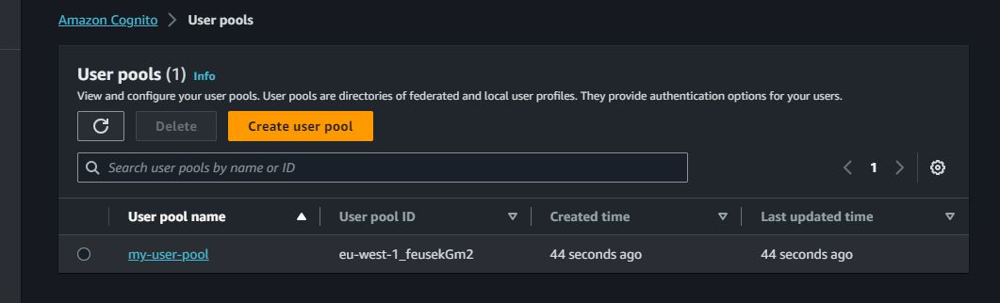
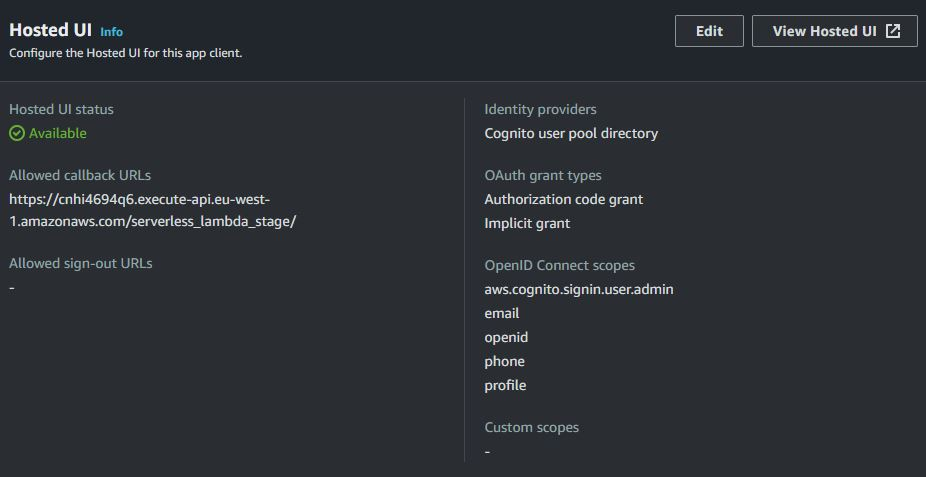
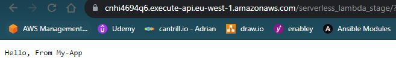
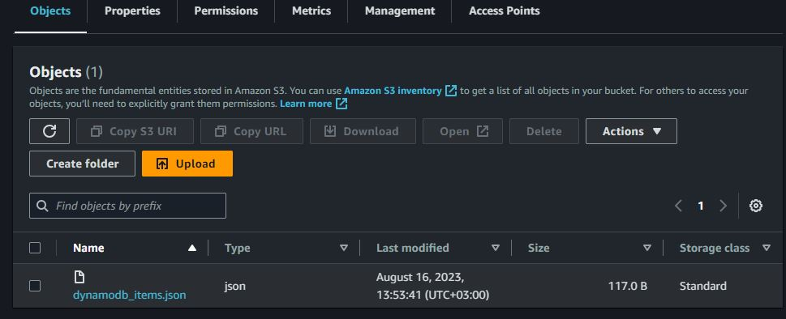

# Project Desctiption:

build web application, for a startup company, that can be accessed from anywhere using http.

Here is the basic flow of the service of the web application:
1. A user browses to the frontend (API Gateway) and gets authenticated with username and password
(Cognito)
2. If authenticated successfully, the service will write the user information (username and date and time) into a
database (DynamoDB)
3. The service will create a file in S3 bucket with the name of the user – The content of the file will be the
current time
4. The service will write a log of failed and successful authentication to CloudWatch
5. The service will then write a message back to the user saying “hello, “ with the name of the user

# Diagram Plan

 
# Resources used for the above solution:

* AWS API Gateway
* Amazon Cognito
* Lambda function
* S3 Bucket
* DynamoDB
* Amazon CloudWatch
* Parameter store
* VPC, Subnets, Security Groups
* IAM Roles and Policies

# Workflow

1) The User will enter to the web application through a "Hosted-UI" link that is connected to the HTTP-API-GATEWAY.
2) a cognito screen will apear, and the user will have to sign-up with a username + password.
4) the cognito will send a varification message to the email the user signed up with.
5) the user use a verification code, geting an access token from cognito, and making contact with the API-GATEWAY
6) API-GATEWAY will validate the token with cognito
7) cognito will return a validation token to API-GATEWAY
8) cognito will invoke a Lambda function trigger (myfunction) that will export the user detail(user_id/email/date of signing in/success or failed attempt) to dynamodb table
9) The service will create a file in S3 bucket and save it there.
10) API-GATEWAY will invoke another lambda that run on a VPC that we created and on our private subnets that locaten in 2 diffrent availability zone. the VPC is connected to a security group that allow access from HTTP(port 80) and SSH(port 22)
11) the function will take the "hello_value" we defined on parameter store - and will post to the user the value of it.

# Visualisation

creating a user pool

creating an app client

attach API-GATEWAY invoke url to cognito hosted-ui

sign-in page

sign-up page

confirm account with cognito validation code

getting inside the web app and getting parameter store value

user info item created on DynamoDB

user data exported to the S3 bucket
